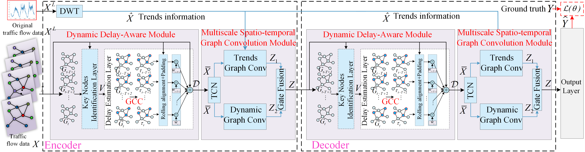

# DDAMGCN-pytorch-main 

## 1. Title

### Multiscale Spatio-Temporal Graph Convolutional Networks with Dynamic Delay Awareness for Traffic Forecasting

## 2. Framework
 

### Requirements
python 3   

see requirements.txt

## 3. Train Commands
```
python train.py --force True --model  DDAMGCN --k_num 50
```
## 4. Test Commands
```
python test.py --force True --model  DDAMGCN --k_num 50
```
## 5. File directory description
eg:

```
filetree 
├── /data/ 
├── /garage/
├── README.md
├── model.py
├── test.py
├── DDAMGCN__best_model.pth
├── train.py
├── utils.py
├── util.py
├── pre_get_trend.py
├── requirements.txt
```
