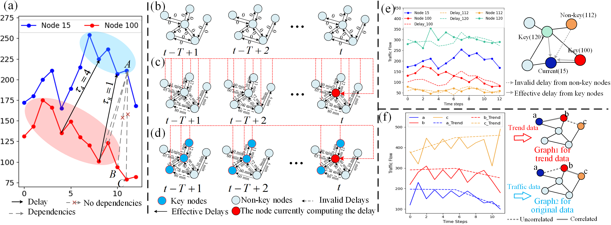

## DDAMGCN-pytorch-main    itle 

## 1. Title

### Multiscale Spatio-Temporal Graph Convolutional Networks with Dynamic Delay Awareness for Traffic Forecasting

## 2. Framework
 

## 3. The code will be uploaded soon

## 4. File directory description
eg:

```
filetree 
├── /data/ 
├── /lib/
├── README.md
├── /logs/
├── /model/
│  ├── DDAMGCN.py
│  ├── train.py
│  ├── DDAMGCN.yaml
│  ├── correlation_trend.npy
└── /saved_models/
```
